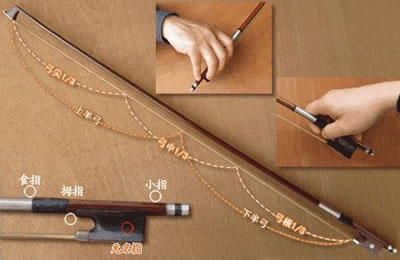

## 小提琴运弓弓段的使用 [Back](../README.md)

琴弓的分配不同也会产生有差异的音色。琴弓的各部份都有其不同特性：弓尖轻巧；中弓便于换拉及演奏弹跳弓法;弓根有重量而且具有坚实性。不同的弓段，人的右臂、右手也要随之进行相应的调整，这样才能使整个琴弓的各个部分发音统一、均匀。

小提琴弓段图

全弓。从弓根开始，慢慢向，上运行，要尽量让琴弓有“在行进”的感觉。小指可以略加压力在弓杆上，起到平衡琴弓的作用”在拉到中弓前，是以上臂向下向后移动为主，下臂为辅，腕部的动作是被动的。运行到中弓时，腕部则渐渐与下臂平行。当运行到弓尖时，小指对于弓杆的压力会逐渐消失，但此时小指却不能随意抬起，依然要保持弯曲的姿势轻放在在弓杆上。食指在琴弓向弓尖方向运行时，力量是有所增加的，直至弓尖。

上半弓。琴弓放在中弓段，向弓尖方向运行。由下臂先行，带动腕部，腕部要放松，成为被带动者。上臂要保持不动，上半弓的运行，以下臂拉弓为主导，要保持弓与琴弦呈90度角，上臂可略向前仲，手腕随之有些向下凹。

下半弓。琴弓放在弓根部位，向下运行，此时因为琴弓是放置在弓根部，所以右臂的位置在身体右侧之前”当开始运行时，右上臂向后自然移动，手腕由弓根向脸方向略微拱起逐渐到中弓时与下臂平行，手腕要松，它是被带动者。在拉下半弓时，注意肘部稍低于弓杆，目的要使手臂的力量通过肘、腕、指，到达弓上再传至琴弦，使其发出所需的声音。

中弓。将琴弓放在弓杆中部，运行时，上臂要保持不动，用下臂运弓。动作幅度较小，手腕是被动的，肘部位置要比较平，要避免手腕及手指僵硬而造成发音粗糙难听。拉中弓时，手指可以自然的做伸屈动作予以配合，但它不可以主动，这样做，可以使快速分弓的发音清晰、透亮;同时，指腕动作可以减少下臂动作的幅度，使下臂动作尽可能的小，却能使运弓相应长一些。手指忌不能有上下动作，否则易使琴弓抖动，随之破坏整个平面，容易碰弦且发出杂音，反而影响了好的音质。
